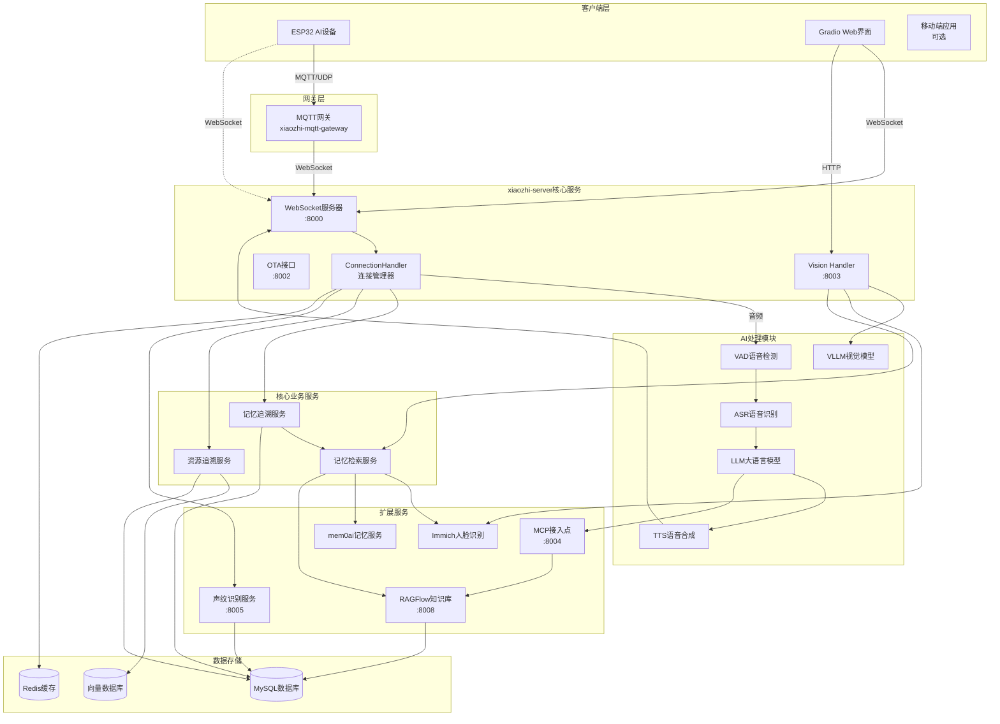

# DeepDiary 系统架构文档

## 一、整体架构

### 1.1 系统架构图



### 1.2 架构层次

**1. 客户端层**

- ESP32 AI 设备：硬件入口
- Gradio Web 界面：Web 入口
- 移动端应用：移动入口（可选）

**2. 网关层**

- MQTT 网关：协议转换

**3. 核心服务层**

- WebSocket 服务器：实时通信
- Vision Handler：视觉处理
- ConnectionHandler：连接管理

**4. AI 处理层**

- VAD/ASR/LLM/TTS/VLLM：AI 能力

**5. 业务服务层**

- 记忆追溯服务
- 资源追溯服务
- 记忆检索服务

**6. 扩展服务层**

- 声纹识别、MCP 接入点、RAGFlow、Immich、mem0ai

**7. 数据存储层**

- MySQL：关系数据
- Redis：缓存数据
- 向量数据库：向量数据

## 二、核心组件设计

### 2.1 记忆追溯服务

**职责：**

- 整合多源数据（日记、照片、GPS、聊天记录）
- 提供记忆检索接口
- 管理记忆数据生命周期

**接口设计：**

```python
class MemoryTracingService:
    """记忆追溯服务"""

    async def trace_by_timeline(self, start_date, end_time, end_time):
        """时间线追溯"""
        pass

    async def trace_by_person(self, person_id):
        """人物追溯"""
        pass

    async def trace_by_location(self, location):
        """地点追溯"""
        pass

    async def trace_by_event(self, keywords):
        """事件追溯"""
        pass
```

### 2.2 资源追溯服务

**职责：**

- 管理资源和需求数据
- 提供匹配和推荐功能
- 管理匹配结果

**接口设计：**

```python
class ResourceTracingService:
    """资源追溯服务"""

    async def register_resource(self, person_id, resource):
        """注册资源"""
        pass

    async def register_demand(self, person_id, demand):
        """注册需求"""
        pass

    async def match_resources(self, demand_id):
        """匹配资源"""
        pass

    async def match_demands(self, resource_id):
        """匹配需求"""
        pass

    async def recommend_opportunities(self, person_id):
        """推荐机会"""
        pass
```

### 2.3 记忆检索服务

**职责：**

- 整合多个数据源
- 提供统一检索接口
- 格式化检索结果

**接口设计：**

```python
class MemoryRetrievalService:
    """记忆检索服务"""

    async def retrieve_memories(self, people, keywords, location):
        """检索记忆"""
        pass

    async def format_markdown(self, memory_data):
        """格式化Markdown"""
        pass
```

## 三、数据流设计

### 3.1 记忆追溯数据流

```
数据源 → 数据采集 → 数据预处理 → 向量化 → 存储
    ↓
用户查询 → 向量检索 → 结果聚合 → 格式化 → 展示
```

### 3.2 资源追溯数据流

```
资源/需求录入 → 向量化 → 存储到向量数据库
    ↓
匹配请求 → 向量检索 → 匹配度计算 → 排序 → 推荐
```

### 3.3 新朋友识别数据流

```
拍照 → 人脸识别 → 未找到 → 对话引导 → 信息收集
    ↓
自动命名 → 声纹注册 → 信息关联 → 资源追溯 → 匹配推荐
```

## 四、接口设计

### 4.1 WebSocket 接口

**消息类型：**

- `stt`：语音识别结果
- `llm`：LLM 回复
- `tts`：TTS 状态
- `vision`：视觉识别结果
- `memory_markdown`：记忆 Markdown 内容
- `memory_images`：记忆图片列表
- `resource_match`：资源匹配结果

### 4.2 HTTP 接口

**视觉接口：**

- `POST /mcp/vision/explain`：图片识别

**记忆接口：**

- `GET /api/memory/timeline`：时间线检索
- `GET /api/memory/person`：人物检索
- `GET /api/memory/location`：地点检索

**资源接口：**

- `POST /api/resource/register`：注册资源
- `POST /api/demand/register`：注册需求
- `GET /api/resource/match`：匹配资源
- `GET /api/demand/match`：匹配需求

## 五、技术选型

### 5.1 核心技术

- **WebSocket**：实时通信
- **向量数据库**：Milvus/Pinecone
- **LLM**：支持多种 LLM 提供商
- **人脸识别**：Immich
- **声纹识别**：自建服务

### 5.2 数据存储

- **MySQL**：关系数据存储
- **Redis**：缓存和会话管理
- **向量数据库**：向量数据存储

### 5.3 前端技术

- **Gradio**：Web 界面框架
- **WebSocket Client**：实时通信客户端

## 六、部署架构

### 6.1 单机部署

```
所有服务部署在同一台服务器
```

### 6.2 分布式部署

```
ESP32设备 → MQTT网关 → xiaozhi-server集群
    ↓
负载均衡 → 多个服务实例
    ↓
共享数据库和缓存
```

## 七、扩展性设计

### 7.1 水平扩展

- 支持多实例部署
- 支持负载均衡
- 支持数据库分片

### 7.2 功能扩展

- 插件系统
- MCP 接入点
- 开放 API

### 7.3 数据扩展

- 支持新数据源接入
- 支持新检索维度
- 支持新匹配算法
