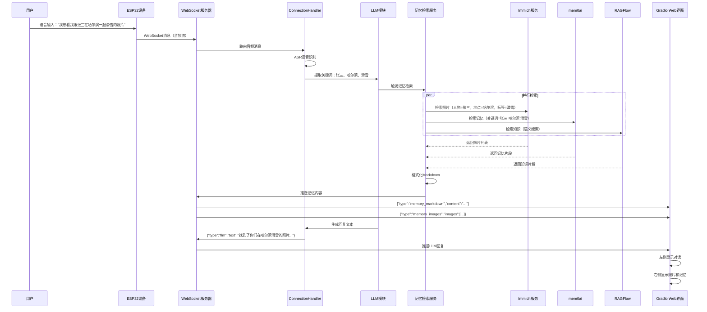
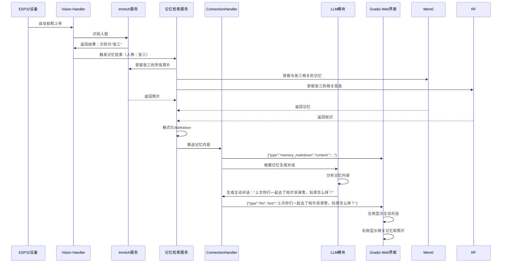
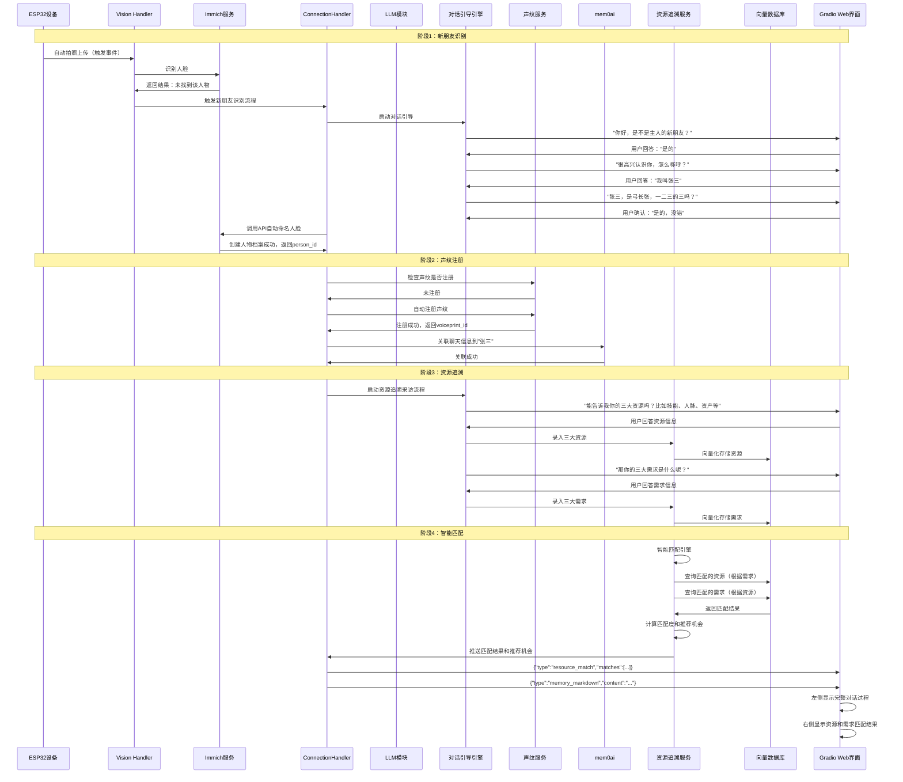

# DeepDiary 场景流程文档

## 一、场景一：主动查询照片

### 1.1 场景描述

用户通过语音或文字查询历史照片，系统自动检索相关记忆并展示。

### 1.2 用户操作

**用户输入：** "我想看我跟张三在哈尔滨一起滑雪的照片"

### 1.3 系统流程

### 1.4 关键技术点

1. **关键词提取**：LLM 从用户输入中提取关键信息
2. **多源检索**：并行检索多个数据源
3. **结果聚合**：整合多个数据源的结果
4. **Markdown 格式化**：将结果格式化为可展示的 Markdown

### 1.5 预期结果

- **聊天界面**：显示用户查询和 AI 回复
- **记忆显示区**：展示相关照片（图片网格）和相关记忆片段

## 二、场景二：自动识别与主动交互

### 2.1 场景描述

系统自动识别来访者，检索相关记忆，主动发起对话。

### 2.2 触发条件

**ESP32 设备检测到人脸** → 自动拍照上传

### 2.3 系统流程

### 2.4 关键技术点

1. **自动触发**：设备自动检测并触发识别流程
2. **记忆检索**：基于识别结果自动检索记忆
3. **主动对话**：根据记忆内容生成主动对话
4. **实时推送**：实时推送记忆内容和对话

### 2.5 预期结果

- **聊天界面**：显示系统主动发起的对话
- **记忆显示区**：展示与识别人物相关的记忆和照片

## 三、场景三：新朋友识别与资源追溯（核心场景）

### 3.1 场景描述

系统自动识别新朋友，引导录入信息，匹配资源和需求。

### 3.2 触发条件

**ESP32 设备检测到未识别的人脸** → 自动拍照上传 → Immich 查询未找到

### 3.3 完整流程

### 3.4 详细步骤说明

#### 步骤 1：人脸识别

- ESP32 设备自动拍照
- 上传到 vision_handler
- 调用 Immich 识别人脸
- 如果未找到，触发新朋友流程

#### 步骤 2：姓名确认对话

**对话流程：**

1. **问候确认**
   - 系统："你好，是不是主人的新朋友？"
   - 用户："是的"

2. **询问姓名**
   - 系统："很高兴认识你，怎么称呼？"
   - 用户："我叫张三"

3. **确认姓名**
   - 系统："张三，是弓长张，一二三的三吗？"
   - 用户："是的，没错"

**技术实现：**

- 使用对话引导引擎管理多轮对话
- LLM 生成合适的引导问题
- 提取和确认用户输入

#### 步骤 3：自动命名

- 调用 Immich API 创建人物
- 上传人脸照片
- 设置人物名称为"张三"
- 返回 person_id

#### 步骤 4：声纹注册

- 检查声纹是否已注册
- 如果未注册，自动注册声纹
- 关联声纹 ID 与人物 ID

#### 步骤 5：信息关联

- 将本次对话关联到"张三"
- 保存到 mem0ai 记忆系统
- 建立人物-记忆关联

#### 步骤 6：资源收集

**资源收集对话：**

1. **询问资源**
   - 系统："能告诉我你的三大资源吗？比如技能、人脉、资产等"
   - 用户："我会Python编程，有一些IT行业的朋友，有一辆车可以共享"

2. **询问需求**
   - 系统："那你的三大需求是什么呢？"
   - 用户："想学习AI技术，拓展人脉，需要一些资金周转"

**信息提取：**

- 使用 LLM 提取结构化信息
- 验证信息完整性
- 确认信息准确性

#### 步骤 7：向量化存储

- 将资源和需求向量化
- 存储到向量数据库
- 建立索引便于检索

#### 步骤 8：智能匹配

**匹配流程：**

1. **需求匹配资源**
   - 根据张三的需求（学习AI技术）
   - 检索系统中能提供AI教学资源的人
   - 计算匹配度

2. **资源匹配需求**
   - 根据张三的资源（Python编程技能）
   - 检索系统中需要Python开发的需求
   - 识别服务机会

3. **机会推荐**
   - 生成推荐理由
   - 评估服务价值
   - 排序推荐结果

#### 步骤 9：结果展示

**Web 界面展示：**

- **左侧聊天区**：显示完整对话过程
- **右侧记忆区**：
  - AI 总结的新朋友信息
  - 三大资源和三大需求
  - 匹配到的资源和需求
  - 推荐的服务机会

### 3.5 关键技术点

1. **多轮对话管理**：管理复杂的对话流程
2. **信息提取**：从自然语言中提取结构化信息
3. **向量化存储**：将资源和需求向量化
4. **智能匹配**：多维度匹配算法
5. **实时推送**：实时推送匹配结果

### 3.6 预期结果

- **人物档案**：在 Immich 中创建"张三"的人物档案
- **声纹注册**：在声纹服务中注册张三的声纹
- **记忆关联**：在 mem0ai 中关联对话记录
- **资源录入**：在资源追溯系统中录入资源和需求
- **匹配结果**：显示匹配的资源和需求，推荐服务机会

## 四、场景四：智能家庭助手

### 4.1 场景描述

在家庭环境中，管理家庭记忆，优化家庭资源利用。

### 4.2 应用场景

- **家庭相册管理**：自动整理家庭照片
- **重要事件提醒**：基于记忆提醒重要日期
- **家庭资源管理**：管理家庭成员的资源和需求
- **家庭协作**：促进家庭成员之间的资源匹配

### 4.3 关键功能

- 家庭成员识别
- 家庭记忆追溯
- 家庭资源匹配
- 智能提醒功能

## 五、场景五：智能办公助手

### 5.1 场景描述

在办公环境中，识别客户，记录会议，匹配业务资源。

### 5.2 应用场景

- **客户识别**：自动识别来访客户
- **会议记录**：自动记录会议内容
- **业务资源匹配**：匹配客户需求与公司资源
- **合作机会推荐**：推荐业务合作机会

### 5.3 关键功能

- 客户管理
- 会议记录
- 业务资源匹配
- 合作机会推荐

## 六、场景六：智能社区服务平台

### 6.1 场景描述

在社区环境中，连接居民，匹配社区资源，促进邻里互助。

### 6.2 应用场景

- **邻里识别**：识别社区居民
- **社区记忆**：记录社区活动和事件
- **社区资源匹配**：匹配居民的资源和需求
- **邻里互助**：促进邻里之间的互助

### 6.3 关键功能

- 居民识别
- 社区记忆管理
- 社区资源匹配
- 互助推荐

## 七、场景流程总结

### 7.1 核心流程

1. **感知**：ESP32 设备感知环境
2. **识别**：识别人物、事件、需求
3. **检索**：检索相关记忆和资源
4. **匹配**：智能匹配资源和需求
5. **推荐**：推荐机会和服务
6. **展示**：在 Web 界面展示结果

### 7.2 关键技术

- **人脸识别**：Immich 服务
- **声纹识别**：声纹服务
- **记忆检索**：多源数据整合
- **资源匹配**：向量化匹配算法
- **智能对话**：LLM 驱动的对话系统

### 7.3 用户体验

- **自动化**：减少人工操作
- **智能化**：智能识别和推荐
- **实时性**：实时推送和更新
- **可视化**：直观的界面展示

