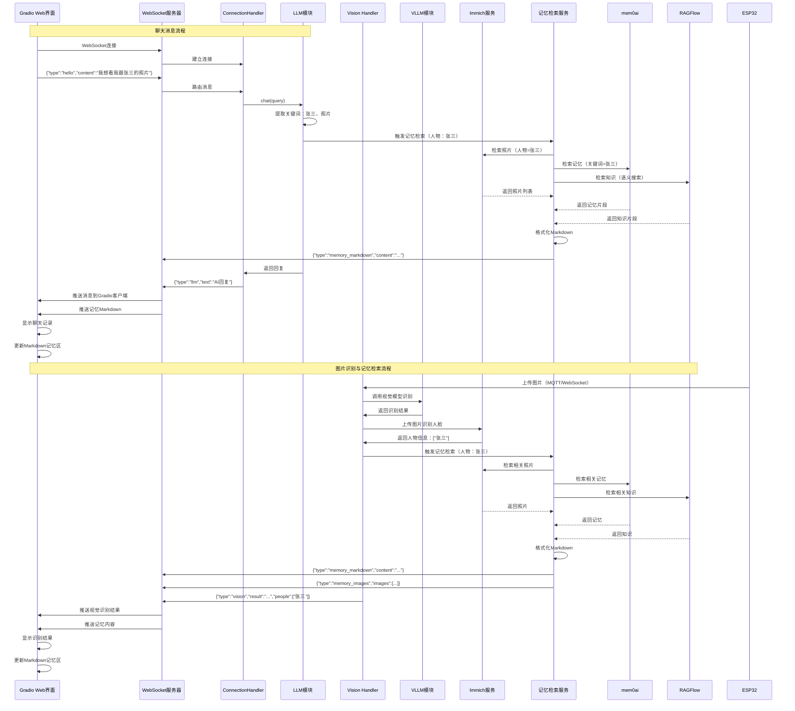
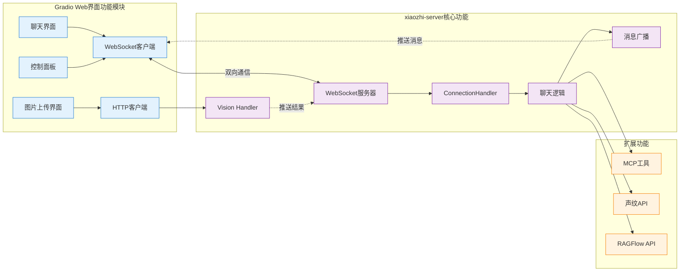
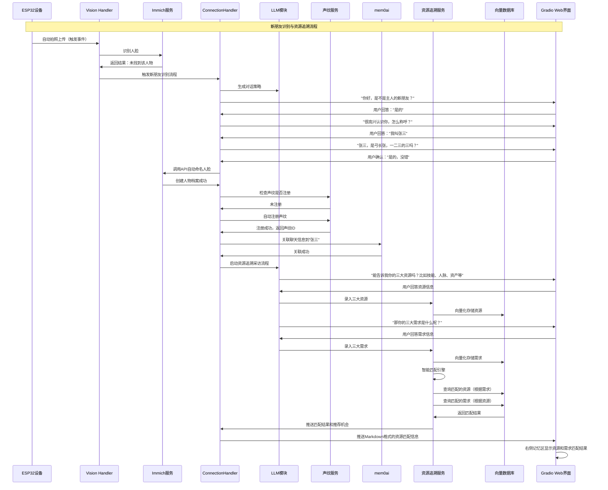

# Gradio Web 界面架构设计

## 一、功能需求概述

### 1.1 核心功能需求

**目标：** 使用家用电视打开 Gradio 构建的 Web 界面，实现智能聊天和记忆展示功能。

#### 1.1.1 页面布局设计

**页面一：智能聊天界面（左右布局）**

```
┌─────────────────────────────────────────────────────────────┐
│                    智能聊天界面                               │
├──────────────────────────┬──────────────────────────────────┤
│                          │                                  │
│      聊天界面区域         │      Markdown记忆显示区          │
│   (chat_interface)       │                                  │
│                          │                                  │
│  - 显示聊天记录          │  - 动态显示相关记忆片段          │
│  - 显示用户上传的图片     │  - 展示相关图片                  │
│  - 支持语音/文字聊天      │  - 根据对话内容自动更新         │
│  - 支持语音/文字控制设备  │  - 支持Markdown格式渲染         │
│                          │                                  │
└──────────────────────────┴──────────────────────────────────┘
```

**页面二：设备控制界面**

```
┌─────────────────────────────────────────────────────────────┐
│                    设备控制界面                               │
│                                                              │
│  - 通过UI下发控制指令到设备                                  │
│  - 显示设备状态                                              │
│  - 支持批量操作                                              │
└─────────────────────────────────────────────────────────────┘
```

#### 1.1.2 智能记忆检索与展示

**核心流程：**

1. **人脸识别触发记忆检索**

   - ESP32 设备拍照或自动识别人脸
   - 调用 Immich 服务识别人名
   - 根据人名检索相关记忆和图片

2. **多源记忆聚合**

   - 从 **Immich** 获取相关照片
   - 从 **mem0ai** 获取记忆片段
   - 从 **RAGFlow** 获取知识库相关内容

3. **动态展示**
   - 在 Markdown 区域实时更新
   - 支持图片、文本、时间线等多种展示方式

#### 1.1.3 应用场景

**场景一：主动查询照片**

```
用户："我想看我跟张三在哈尔滨一起滑雪的照片"
    ↓
系统识别关键词：张三、哈尔滨、滑雪
    ↓
1. 从Immich检索相关照片（人物：张三，地点：哈尔滨，标签：滑雪）
2. 从mem0ai检索相关记忆片段
3. 从RAGFlow检索相关知识
    ↓
在Markdown区域展示：
- 相关照片（图片网格）
- 记忆片段（时间线）
- 相关描述（文本）
```

**场景二：自动识别与主动交互**

```
朋友张三来访
    ↓
ESP32自动识别人脸 → Immich识别为"张三"
    ↓
自动触发记忆检索：
1. 从Immich获取张三的所有照片
2. 从mem0ai获取与张三相关的记忆
3. 从RAGFlow获取张三的相关信息
    ↓
Markdown区域动态展示：
- 最近与张三的互动记录
- 相关照片展示
- 重要事件时间线
    ↓
系统根据记忆主动聊天：
- "上次你们一起去了哈尔滨滑雪，玩得怎么样？"
- 聊天框显示对话内容
- Markdown区域同步显示相关记忆片段
```

**场景三：新朋友识别与资源追溯（核心场景）**

```
新朋友出现（家里/车里设备触发）
    ↓
ESP32自动拍照上传 → vision_handler
    ↓
调用Immich识别人脸 → 查询结果：未找到该人物
    ↓
系统主动发起对话：
1. "你好，是不是主人的新朋友？"
2. 等待回答："是的"
3. "很高兴认识你，怎么称呼？"
4. 等待回答："我叫张三"
5. "张三，是弓长张，一二三的三吗？"
6. 等待确认："是的，没错"
    ↓
调用Immich API自动命名人脸：
- 上传人脸照片
- 设置人物名称为"张三"
- 创建新人物档案
    ↓
声纹识别检查：
- 检查声纹是否已注册
- 如果未注册 → 自动注册声纹
- 关联声纹ID与人物ID
    ↓
关联聊天信息：
- 将本次对话关联到"张三"
- 保存到mem0ai记忆系统
    ↓
资源追溯流程启动：
系统充当采访者角色，引导询问：
1. "能告诉我你的三大资源吗？比如技能、人脉、资产等"
2. 等待回答并记录
3. "那你的三大需求是什么呢？"
4. 等待回答并记录
    ↓
向量化存储：
- 将资源和需求向量化
- 存储到向量数据库（用于匹配）
    ↓
智能匹配：
1. 根据张三的需求，查询系统中匹配的资源
   - 找到可以提供帮助的人/资源
   - 推送匹配结果
2. 根据张三的资源，查询系统中匹配的需求
   - 找到需要张三资源的人/需求
   - 提供"服务别人，赚取额外收入"的机会
    ↓
Web界面实时展示：
- 左侧聊天框：显示完整对话过程
- 右侧记忆区：
  * AI总结的新朋友信息
  * 三大资源和三大需求
  * 匹配到的资源和需求
  * 推荐的服务机会
```

### 1.2 技术架构评估

#### ✅ 优点

1. **WebSocket 连接合理**：xiaozhi-server 原生支持 WebSocket，可以复用现有协议
2. **实时通信**：WebSocket 支持双向实时通信，适合聊天场景
3. **统一协议**：与 ESP32 设备使用相同的 WebSocket 协议，架构统一

#### ⚠️ 需要改进的地方

**问题 1：视觉处理流程**

- `vision_handler.py` 处理的是 **HTTP POST** 请求，不是 WebSocket
- 图片上传和识别结果返回都是通过 HTTP 协议
- 需要将识别结果推送到 Web 界面，需要额外的机制

**问题 2：消息推送机制**

- 当前系统是**设备主动连接**服务器
- Gradio Web 界面需要**主动连接**服务器并接收消息
- 需要建立 WebSocket 连接管理机制，支持多个客户端

**问题 3：聊天记录获取**

- 聊天记录存储在 `ConnectionHandler.dialogue` 中
- 需要将对话内容实时推送到 Web 界面
- 当前系统只在 `chat()` 方法中处理，需要添加消息推送逻辑

**问题 4：记忆检索与推送（新增）**

- 需要实现记忆检索服务，整合 Immich、mem0ai、RAGFlow
- 需要将检索结果格式化为 Markdown 并推送到 Gradio 客户端
- 需要实现智能触发机制（人脸识别、关键词提取）
- 需要支持实时更新 Markdown 显示区

### 1.3 改进后的架构方案（增强版）

#### 方案 A：混合架构（推荐）

```
Gradio Web界面
    ├─ WebSocket连接 → xiaozhi-server (聊天、控制指令)
    │   ├─ 发送文本消息
    │   ├─ 接收聊天记录 (stt/llm消息)
    │   └─ 接收TTS状态
    │
    └─ HTTP API → vision_handler (图片上传)
        ├─ POST /mcp/vision/explain (上传图片)
        └─ 通过WebSocket接收识别结果 (需要扩展)
```

**实现要点：**

1. **WebSocket 连接**：Gradio 作为客户端连接 xiaozhi-server
2. **图片上传**：通过 HTTP API 上传图片到 vision_handler
3. **结果推送**：扩展 vision_handler，处理完成后通过 WebSocket 推送结果到 Gradio 客户端

#### 方案 B：纯 WebSocket 架构

```
Gradio Web界面
    └─ WebSocket连接 → xiaozhi-server
        ├─ 文本消息 (聊天)
        ├─ 二进制消息 (图片上传)
        └─ 接收所有消息 (聊天记录、图片识别结果)
```

**实现要点：**

1. 扩展 WebSocket 协议，支持图片上传
2. 在 vision_handler 中集成 WebSocket 消息处理
3. 统一使用 WebSocket 进行所有通信

**推荐方案 A（增强版）**，因为：

- 图片上传使用 HTTP multipart/form-data 更标准
- 不需要修改现有的 vision_handler 核心逻辑
- 实现更简单，维护成本更低
- **新增**：支持记忆检索服务集成，通过 WebSocket 推送 Markdown 格式的记忆内容

### 1.4 记忆检索服务架构

**核心组件：**

```
记忆检索服务 (Memory Retrieval Service)
    ├─ Immich集成
    │   ├─ 人脸识别API
    │   ├─ 照片检索API（按人物、地点、标签）
    │   └─ 照片元数据获取
    │
    ├─ mem0ai集成
    │   ├─ 记忆片段检索（按人物、关键词）
    │   ├─ 时间线查询
    │   └─ 记忆关联查询
    │
    ├─ RAGFlow集成
    │   ├─ 知识库检索
    │   ├─ 语义搜索
    │   └─ 文档片段提取
    │
    └─ Markdown格式化
        ├─ 图片网格布局
        ├─ 时间线展示
        ├─ 文本片段展示
        └─ 实时更新推送
```

**触发机制：**

1. **人脸识别触发**

   - ESP32 设备拍照 → Immich 识别人脸 → 触发记忆检索
   - 自动识别来访者 → 主动检索相关记忆

2. **关键词触发**

   - 用户对话中包含人名、地点等关键词
   - LLM 提取关键信息 → 触发记忆检索

3. **主动查询触发**
   - 用户明确要求查看照片或记忆
   - 直接调用记忆检索服务

## 二、详细架构设计

### 2.1 系统组件（增强版）

```
┌─────────────────────────────────────────────────────────────┐
│                    Gradio Web 界面                           │
│  ┌──────────────────────────┬────────────────────────────┐ │
│  │  聊天界面区域             │  Markdown记忆显示区         │ │
│  │  (chat_interface)        │                            │ │
│  │                          │  - 动态显示记忆片段        │ │
│  │  - 显示聊天记录          │  - 展示相关图片            │ │
│  │  - 显示用户上传的图片     │  - 时间线展示              │ │
│  │  - 支持语音/文字聊天      │  - 实时更新                │ │
│  │  - 支持控制设备           │                            │ │
│  └──────────────────────────┴────────────────────────────┘ │
│                    WebSocket客户端                          │
│                    HTTP客户端                               │
└───────────────────────────┼─────────────────────────────────┘
                             │
                             │ WebSocket (ws://host:8000/xiaozhi/v1/)
                             │ HTTP POST (http://host:8003/mcp/vision/explain)
                             │
┌────────────────────────────┼─────────────────────────────────┐
│                            ▼                                 │
│                  xiaozhi-server                              │
│  ┌──────────────────────────────────────────────────────┐  │
│  │  WebSocket服务器 (8000端口)                          │  │
│  │  - 处理文本消息                                       │  │
│  │  - 发送聊天记录 (stt/llm/tts)                        │  │
│  │  - 发送记忆内容 (memory_markdown)                    │  │
│  │  - 处理控制指令                                       │  │
│  └──────────────────────────────────────────────────────┘  │
│  ┌──────────────────────────────────────────────────────┐  │
│  │  Vision Handler (8003端口)                          │  │
│  │  - 接收图片上传                                       │  │
│  │  - 调用VLLM进行识别                                  │  │
│  │  - 调用Immich进行人脸识别                            │  │
│  │  - 触发记忆检索服务                                  │  │
│  │  - 通过WebSocket推送结果到Gradio客户端               │  │
│  └──────────────────────────────────────────────────────┘  │
│  ┌──────────────────────────────────────────────────────┐  │
│  │  记忆检索服务 (Memory Retrieval Service)            │  │
│  │  - 整合Immich照片检索                               │  │
│  │  - 整合mem0ai记忆检索                               │  │
│  │  - 整合RAGFlow知识检索                              │  │
│  │  - Markdown格式化                                    │  │
│  │  - 推送到Gradio客户端                                │  │
│  └──────────────────────────────────────────────────────┘  │
│  ┌──────────────────────────────────────────────────────┐  │
│  │  ConnectionHandler                                   │  │
│  │  - 管理WebSocket连接                                  │  │
│  │  - 处理聊天逻辑 (chat方法)                           │  │
│  │  - 关键词提取与记忆触发                              │  │
│  │  - 推送消息到所有连接的客户端                        │  │
│  └──────────────────────────────────────────────────────┘  │
└───────────────────────────────────────────────────────────────┘
```

### 2.2 消息流程

#### 2.2.1 聊天消息流程

```
用户输入文本
    ↓
Gradio Web界面
    ↓
WebSocket发送: {"type": "hello", "content": "用户消息"}
    ↓
xiaozhi-server接收
    ↓
ConnectionHandler.chat()
    ↓
LLM处理
    ↓
WebSocket发送: {"type": "llm", "text": "AI回复"}
    ↓
Gradio Web界面显示
```

#### 2.2.2 图片识别与记忆检索流程

**流程一：ESP32 设备拍照触发**

```
ESP32设备拍照
    ↓
通过MQTT/WebSocket上传图片
    ↓
vision_handler.handle_post()
    ├─ 调用VLLM识别图片内容
    ├─ 调用Immich识别人脸 → 获取人名列表
    └─ 触发记忆检索服务
        ↓
记忆检索服务 (Memory Retrieval Service)
    ├─ 从Immich检索相关照片
    │   └─ 查询条件：人物、地点、标签、时间范围
    ├─ 从mem0ai检索记忆片段
    │   └─ 查询条件：人物、关键词、时间范围
    └─ 从RAGFlow检索相关知识
        └─ 查询条件：语义搜索、关键词
    ↓
格式化Markdown内容
    ├─ 图片网格（Immich照片）
    ├─ 时间线（mem0ai记忆）
    └─ 文本片段（RAGFlow知识）
    ↓
通过WebSocket推送结果到Gradio客户端
    ├─ {"type": "vision", "result": "识别结果", "people": ["张三"]}
    ├─ {"type": "memory_markdown", "content": "# 相关记忆\n..."}
    └─ {"type": "memory_images", "images": [url1, url2, ...]}
    ↓
Gradio Web界面
    ├─ 聊天界面显示识别结果和照片
    └─ Markdown区域动态更新记忆内容
```

**流程二：用户对话触发记忆检索**

```
用户："我想看我跟张三在哈尔滨一起滑雪的照片"
    ↓
ConnectionHandler.chat()
    ↓
LLM处理，提取关键词
    ├─ 人物：张三
    ├─ 地点：哈尔滨
    └─ 活动：滑雪
    ↓
触发记忆检索服务
    ├─ Immich检索：人物=张三, 地点=哈尔滨, 标签=滑雪
    ├─ mem0ai检索：关键词="张三 哈尔滨 滑雪"
    └─ RAGFlow检索：语义搜索相关文档
    ↓
格式化并推送Markdown内容
    ↓
Gradio Web界面
    ├─ 聊天界面显示LLM回复
    └─ Markdown区域展示相关照片和记忆
```

**流程三：自动识别触发（场景二）**

```
朋友张三来访
    ↓
ESP32自动识别人脸
    ↓
Immich识别为"张三"
    ↓
自动触发记忆检索（无需用户请求）
    ├─ 获取张三的所有照片（最近N张）
    ├─ 获取与张三相关的记忆片段
    └─ 获取张三的相关信息
    ↓
推送记忆内容到Gradio
    ↓
系统根据记忆主动生成对话
    ├─ "上次你们一起去了哈尔滨滑雪，玩得怎么样？"
    └─ 聊天框显示对话，Markdown区域显示相关记忆
```

### 2.3 需要实现的功能

#### 2.3.1 xiaozhi-server 扩展

**1. WebSocket 连接管理**

```python
# 在 websocket_server.py 中添加客户端连接管理
class WebSocketServer:
    def __init__(self):
        self.gradio_clients = set()  # Gradio客户端连接集合

    async def register_gradio_client(self, websocket):
        """注册Gradio客户端"""
        self.gradio_clients.add(websocket)

    async def broadcast_to_gradio(self, message):
        """向所有Gradio客户端广播消息"""
        for client in self.gradio_clients.copy():
            try:
                await client.send(json.dumps(message))
            except:
                self.gradio_clients.discard(client)
```

**2. 聊天消息推送**

```python
# 在 connection.py 的 chat() 方法中添加消息推送
async def chat(self, query, depth=0):
    # ... 现有逻辑 ...

    # 推送STT消息到Gradio客户端
    if query:
        await self.server.broadcast_to_gradio({
            "type": "stt",
            "text": query,
            "session_id": self.session_id
        })

    # ... LLM处理 ...

    # 推送LLM回复到Gradio客户端
    if response_message:
        await self.server.broadcast_to_gradio({
            "type": "llm",
            "text": "".join(response_message),
            "session_id": self.session_id
        })
```

**3. 视觉识别结果推送与记忆检索**

```python
# 在 vision_handler.py 中添加WebSocket推送和记忆检索
async def handle_post(self, request):
    # ... 现有识别逻辑 ...

    # 识别人脸后，触发记忆检索
    memory_markdown = None
    memory_images = []

    if people_names:
        # 调用记忆检索服务
        memory_service = MemoryRetrievalService(
            immich_client=self.immich_client,
            mem0_client=self.mem0_client,
            ragflow_client=self.ragflow_client
        )

        # 检索记忆
        memory_data = await memory_service.retrieve_memories(
            people=people_names,
            keywords=question,  # 从问题中提取关键词
            limit=10  # 限制返回数量
        )

        # 格式化Markdown
        memory_markdown = memory_service.format_markdown(memory_data)
        memory_images = memory_data.get("images", [])

    # 通过WebSocket推送结果到Gradio客户端
    if self.server:
        # 推送视觉识别结果
        await self.server.broadcast_to_gradio({
            "type": "vision",
            "result": result,
            "people": people_names,
            "session_id": session_id
        })

        # 推送记忆内容（Markdown格式）
        if memory_markdown:
            await self.server.broadcast_to_gradio({
                "type": "memory_markdown",
                "content": memory_markdown,
                "session_id": session_id
            })

        # 推送相关图片
        if memory_images:
            await self.server.broadcast_to_gradio({
                "type": "memory_images",
                "images": memory_images,
                "session_id": session_id
            })
```

**4. 记忆检索服务实现**

```python
# 新建 memory_retrieval_service.py
import asyncio
from typing import List, Dict, Optional

class MemoryRetrievalService:
    def __init__(self, immich_client, mem0_client, ragflow_client):
        self.immich_client = immich_client
        self.mem0_client = mem0_client
        self.ragflow_client = ragflow_client

    async def retrieve_memories(
        self,
        people: List[str] = None,
        keywords: str = None,
        location: str = None,
        limit: int = 10
    ) -> Dict:
        """检索记忆，整合多个数据源"""
        results = {
            "images": [],
            "memories": [],
            "knowledge": []
        }

        # 并行检索多个数据源
        tasks = []

        if people:
            # 从Immich检索照片
            tasks.append(self._retrieve_immich_photos(people, location, limit))
            # 从mem0ai检索记忆
            tasks.append(self._retrieve_mem0_memories(people, keywords, limit))

        if keywords:
            # 从RAGFlow检索知识
            tasks.append(self._retrieve_ragflow_knowledge(keywords, limit))

        # 等待所有任务完成
        retrieved_data = await asyncio.gather(*tasks, return_exceptions=True)

        # 整合结果
        for data in retrieved_data:
            if isinstance(data, dict):
                if "images" in data:
                    results["images"].extend(data["images"])
                if "memories" in data:
                    results["memories"].extend(data["memories"])
                if "knowledge" in data:
                    results["knowledge"].extend(data["knowledge"])

        return results

    async def _retrieve_immich_photos(self, people, location, limit):
        """从Immich检索照片"""
        # 调用Immich API检索照片
        photos = await self.immich_client.search_photos(
            people=people,
            location=location,
            limit=limit
        )
        return {"images": photos}

    async def _retrieve_mem0_memories(self, people, keywords, limit):
        """从mem0ai检索记忆"""
        # 调用mem0ai API检索记忆
        memories = await self.mem0_client.search_memories(
            people=people,
            keywords=keywords,
            limit=limit
        )
        return {"memories": memories}

    async def _retrieve_ragflow_knowledge(self, keywords, limit):
        """从RAGFlow检索知识"""
        # 调用RAGFlow API检索知识
        knowledge = await self.ragflow_client.search(
            query=keywords,
            limit=limit
        )
        return {"knowledge": knowledge}

    def format_markdown(self, memory_data: Dict) -> str:
        """将记忆数据格式化为Markdown"""
        markdown_parts = []

        # 添加标题
        if memory_data.get("images") or memory_data.get("memories"):
            markdown_parts.append("# 📸 相关记忆\n")

        # 添加照片部分
        if memory_data.get("images"):
            markdown_parts.append("## 相关照片\n")
            for img in memory_data["images"][:6]:  # 最多显示6张
                markdown_parts.append(f"")
            markdown_parts.append("")

        # 添加记忆片段
        if memory_data.get("memories"):
            markdown_parts.append("## 记忆片段\n")
            for memory in memory_data["memories"][:5]:  # 最多显示5条
                markdown_parts.append(f"- **{memory.get('date', '')}**: {memory.get('content', '')}")
            markdown_parts.append("")

        # 添加相关知识
        if memory_data.get("knowledge"):
            markdown_parts.append("## 相关知识\n")
            for knowledge in memory_data["knowledge"][:3]:  # 最多显示3条
                markdown_parts.append(f"- {knowledge.get('content', '')}")
            markdown_parts.append("")

        return "\n".join(markdown_parts)
```

#### 2.3.2 Gradio Web 界面实现

**1. WebSocket 客户端**

```python
import websockets
import json
import asyncio

class XiaozhiWebSocketClient:
    def __init__(self, url):
        self.url = url
        self.websocket = None
        self.messages = []  # 存储聊天记录

    async def connect(self):
        """连接WebSocket服务器"""
        self.websocket = await websockets.connect(self.url)

    async def send_message(self, text):
        """发送文本消息"""
        message = {
            "type": "hello",
            "content": text
        }
        await self.websocket.send(json.dumps(message))

    async def receive_messages(self, callback):
        """接收消息并回调"""
        async for message in self.websocket:
            data = json.loads(message)
            if data.get("type") == "stt":
                # 用户消息
                callback("user", data.get("text"))
            elif data.get("type") == "llm":
                # AI回复
                callback("assistant", data.get("text"))
            elif data.get("type") == "vision":
                # 图片识别结果
                callback("vision", data.get("result"))
```

**2. Gradio 界面（左右布局，支持记忆展示）**

```python
import gradio as gr
import asyncio
import json
from xiaozhi_websocket_client import XiaozhiWebSocketClient

# 全局变量存储状态
chat_history = []
memory_markdown = "# 记忆显示区\n\n等待记忆内容..."

# 创建WebSocket客户端
ws_client = XiaozhiWebSocketClient("ws://localhost:8000/xiaozhi/v1/")

# WebSocket消息处理回调
def handle_websocket_message(message_type, data):
    """处理WebSocket消息"""
    global chat_history, memory_markdown

    if message_type == "stt":
        # 用户消息
        chat_history.append([data.get("text"), None])
    elif message_type == "llm":
        # AI回复
        if chat_history and chat_history[-1][1] is None:
            chat_history[-1][1] = data.get("text")
        else:
            chat_history.append([None, data.get("text")])
    elif message_type == "vision":
        # 图片识别结果
        result = data.get("result", "")
        people = data.get("people", [])
        if people:
            result += f"\n\n识别到的人物：{', '.join(people)}"
        chat_history.append([None, f"📷 {result}"])
    elif message_type == "memory_markdown":
        # 记忆Markdown内容
        memory_markdown = data.get("content", "")
    elif message_type == "memory_images":
        # 记忆图片
        images = data.get("images", [])
        # 将图片URL添加到Markdown中
        if images:
            image_markdown = "\n".join([f"" for img in images[:6]])
            memory_markdown += f"\n\n## 相关照片\n\n{image_markdown}"

    return chat_history, memory_markdown

# 启动WebSocket消息接收任务
async def start_websocket_listener():
    """启动WebSocket消息监听"""
    await ws_client.connect()
    await ws_client.receive_messages(handle_websocket_message)

# 聊天界面处理函数
def chat_interface(message, history):
    """处理聊天消息"""
    if message:
        # 发送消息到服务器
        asyncio.run(ws_client.send_message(message))
        # 消息会通过WebSocket回调更新
    return history

# 图片上传处理函数
def upload_image(image, question):
    """上传图片并触发识别"""
    import requests
    if image:
        files = {"file": open(image, "rb")}
        data = {"question": question or "描述这张图片"}
        response = requests.post(
            "http://localhost:8003/mcp/vision/explain",
            files=files,
            data=data,
            headers={
                "Device-Id": "gradio-web",
                "Client-Id": "gradio-client"
            }
        )
        # 结果会通过WebSocket推送，这里只返回提示
        return "图片已上传，正在识别..."
    return "请先选择图片"

# 创建Gradio界面
with gr.Blocks(theme=gr.themes.Soft()) as demo:
    gr.Markdown("# 🏠 小智智能家居控制中心")

    # 页面一：智能聊天界面（左右布局）
    with gr.Tab("💬 智能聊天"):
        with gr.Row():
            # 左侧：聊天界面
            with gr.Column(scale=2):
                chatbot = gr.Chatbot(
                    label="聊天记录",
                    height=600,
                    show_label=True,
                    avatar_images=(None, "🤖")  # 用户头像，AI头像
                )
                with gr.Row():
                    msg = gr.Textbox(
                        label="输入消息",
                        placeholder="输入消息或语音控制设备...",
                        scale=4
                    )
                    submit_btn = gr.Button("发送", scale=1)

                # 语音输入（可选）
                audio_input = gr.Audio(
                    label="语音输入",
                    type="filepath",
                    sources=["microphone"]
                )

            # 右侧：Markdown记忆显示区
            with gr.Column(scale=1):
                memory_display = gr.Markdown(
                    value=memory_markdown,
                    label="记忆显示区",
                    height=600
                )
                refresh_btn = gr.Button("刷新记忆", size="sm")

        # 事件绑定
        msg.submit(chat_interface, [msg, chatbot], [chatbot])
        submit_btn.click(chat_interface, [msg, chatbot], [chatbot])
        submit_btn.click(lambda: "", None, [msg])  # 清空输入框

        # 定时更新（用于接收WebSocket消息）
        demo.load(
            fn=lambda: (chat_history, memory_markdown),
            inputs=None,
            outputs=[chatbot, memory_display],
            every=1  # 每秒更新一次
        )

    # 页面二：设备控制界面
    with gr.Tab("🎛️ 设备控制"):
        gr.Markdown("## 设备控制面板")

        with gr.Row():
            with gr.Column():
                device_list = gr.CheckboxGroup(
                    choices=["客厅灯", "卧室灯", "空调", "窗帘"],
                    label="选择设备"
                )
                control_action = gr.Radio(
                    choices=["打开", "关闭", "调节"],
                    label="操作"
                )
                control_value = gr.Slider(
                    minimum=0,
                    maximum=100,
                    value=50,
                    label="数值（调节时使用）"
                )
                control_btn = gr.Button("执行控制", variant="primary")

        control_output = gr.Textbox(label="控制结果", interactive=False)

        def execute_control(devices, action, value):
            """执行设备控制"""
            if not devices:
                return "请先选择设备"

            # 构建控制指令
            command = {
                "type": "iot",
                "devices": devices,
                "action": action,
                "value": value if action == "调节" else None
            }

            # 通过WebSocket发送控制指令
            asyncio.run(ws_client.send_message(json.dumps(command)))
            return f"已发送控制指令：{action} {', '.join(devices)}"

        control_btn.click(
            execute_control,
            [device_list, control_action, control_value],
            [control_output]
        )

    # 启动WebSocket监听（后台任务）
    demo.load(
        fn=lambda: asyncio.create_task(start_websocket_listener()),
        inputs=None,
        outputs=None
    )

# 启动应用
if __name__ == "__main__":
    demo.launch(
        server_name="0.0.0.0",  # 允许局域网访问
        server_port=7860,
        share=False  # 设置为True可以生成公网链接
    )
```

## 三、架构优势

### 3.1 技术优势

1. **复用现有协议**：使用 xiaozhi-server 现有的 WebSocket 协议，无需重新设计
2. **实时通信**：WebSocket 支持双向实时通信，适合聊天场景
3. **扩展性好**：可以轻松添加新的消息类型和功能
4. **统一管理**：所有客户端（ESP32 设备、Gradio Web）使用相同的协议

### 3.2 实现优势

1. **开发成本低**：主要是在现有代码基础上添加推送逻辑
2. **维护简单**：不需要维护多套协议
3. **兼容性好**：不影响现有的 ESP32 设备连接

## 四、注意事项

### 4.1 认证问题

- Gradio Web 界面连接 WebSocket 时，需要处理认证
- 可能需要添加特殊的认证机制，区分 Gradio 客户端和设备客户端

### 4.2 会话管理

- 每个 Gradio 客户端应该有自己的 session_id
- 需要管理多个 Gradio 客户端的连接状态

### 4.3 消息格式

- 需要确保推送的消息格式与现有协议兼容
- 可以考虑添加 `client_type` 字段区分客户端类型

### 4.4 性能考虑

- 如果有很多 Gradio 客户端连接，广播消息可能影响性能
- 可以考虑使用消息队列（如 Redis Pub/Sub）进行消息分发

## 五、系统架构图

### 5.1 完整系统架构图

```mermaid
graph TB
    subgraph "客户端层"
        ESP32[ESP32设备]
        Gradio[Gradio Web界面]
    end

    subgraph "MQTT网关层"
        MQTTGW[MQTT网关<br/>xiaozhi-mqtt-gateway]
    end

    subgraph "xiaozhi-server核心服务"
        WS[WebSocket服务器<br/>:8000]
        Vision[Vision Handler<br/>:8003]
        OTA[OTA接口<br/>:8002]
        ConnMgr[ConnectionHandler<br/>连接管理器]
    end

    subgraph "AI处理模块"
        VAD[VAD语音检测]
        ASR[ASR语音识别]
        LLM[LLM大语言模型]
        TTS[TTS语音合成]
        VLLM[VLLM视觉模型]
    end

    subgraph "扩展服务"
        Voiceprint[声纹识别服务<br/>:8005]
        MCPEndpoint[MCP接入点<br/>:8004]
        RAGFlow[RAGFlow知识库<br/>:8008]
        Immich[Immich人脸识别]
        Mem0AI[mem0ai记忆服务]
        MemRetrieval[记忆检索服务<br/>Memory Retrieval Service]
    end

    subgraph "数据存储"
        MySQL[(MySQL数据库)]
        Redis[(Redis缓存)]
    end

    %% ESP32设备连接
    ESP32 -->|MQTT/UDP| MQTTGW
    ESP32 -.->|WebSocket直连| WS
    MQTTGW -->|WebSocket转换| WS

    %% Gradio Web界面连接
    Gradio -->|WebSocket<br/>聊天/控制| WS
    Gradio -->|HTTP POST<br/>图片上传| Vision

    %% WebSocket服务器处理
    WS --> ConnMgr
    ConnMgr -->|音频流| VAD
    VAD --> ASR
    ASR -->|文本| LLM
    LLM -->|回复文本| TTS
    TTS -->|音频流| WS

    %% 聊天消息推送
    ConnMgr -.->|推送消息<br/>stt/llm/tts| Gradio

    %% 视觉处理流程
    Vision -->|调用| VLLM
    Vision -->|调用| Immich
    Vision -->|触发| MemRetrieval
    MemRetrieval -->|检索照片| Immich
    MemRetrieval -->|检索记忆| Mem0AI
    MemRetrieval -->|检索知识| RAGFlow
    MemRetrieval -.->|推送Markdown<br/>WebSocket| Gradio
    Vision -.->|推送结果<br/>WebSocket| Gradio

    %% LLM工具调用
    LLM -->|工具调用| MCPEndpoint
    MCPEndpoint -->|MCP协议| RAGFlow
    LLM -->|设备MCP| ConnMgr
    LLM -->|关键词提取<br/>触发记忆检索| MemRetrieval

    %% 声纹识别
    ConnMgr -->|声纹识别| Voiceprint
    Voiceprint --> MySQL

    %% 知识库
    LLM -->|知识检索| RAGFlow
    RAGFlow --> MySQL

    %% 配置下发
    ESP32 -->|OTA请求| OTA
    OTA -->|MQTT配置| ESP32

    %% 数据存储
    ConnMgr -->|记忆存储| MySQL
    Voiceprint --> MySQL
    RAGFlow --> MySQL
    ConnMgr -->|缓存| Redis

    %% 样式定义
    classDef clientStyle fill:#e1f5ff,stroke:#01579b,stroke-width:2px
    classDef serverStyle fill:#f3e5f5,stroke:#4a148c,stroke-width:2px
    classDef aiStyle fill:#e8f5e9,stroke:#1b5e20,stroke-width:2px
    classDef extStyle fill:#fff3e0,stroke:#e65100,stroke-width:2px
    classDef dataStyle fill:#fce4ec,stroke:#880e4f,stroke-width:2px

    class ESP32,Gradio clientStyle
    class WS,Vision,OTA,ConnMgr,MQTTGW serverStyle
    class VAD,ASR,LLM,TTS,VLLM aiStyle
    class Voiceprint,MCPEndpoint,RAGFlow,Immich,Mem0AI,MemRetrieval extStyle
    class MySQL,Redis dataStyle
```



### 5.2 消息流转详细图（增强版）



### 5.3 组件交互图



## 六、总结

**推荐的架构方案（增强版）：**

1. ✅ **使用 WebSocket** 进行聊天和控制指令通信
2. ✅ **使用 HTTP API** 进行图片上传
3. ✅ **扩展 vision_handler** 通过 WebSocket 推送识别结果
4. ✅ **扩展 ConnectionHandler** 推送聊天记录到 Gradio 客户端
5. ✅ **新增记忆检索服务** 整合 Immich、mem0ai、RAGFlow
6. ✅ **Markdown 记忆展示** 实时推送格式化的记忆内容
7. ✅ **左右布局界面** 聊天界面 + 记忆显示区

这个架构既保持了系统的简洁性，又充分利用了现有的基础设施，并新增了智能记忆检索和展示功能，是一个平衡了实现复杂度和功能需求的方案。

### 6.1 关键技术点

1. **WebSocket 连接管理**：需要维护 Gradio 客户端连接集合
2. **消息广播机制**：向所有 Gradio 客户端推送消息（聊天、记忆）
3. **会话管理**：每个 Gradio 客户端独立的 session_id
4. **认证机制**：区分 Gradio 客户端和设备客户端
5. **记忆检索服务**：整合多个数据源（Immich、mem0ai、RAGFlow）
6. **Markdown 格式化**：将记忆数据格式化为可展示的 Markdown
7. **智能触发机制**：人脸识别、关键词提取自动触发记忆检索
8. **实时更新机制**：Gradio 界面定时刷新，接收 WebSocket 推送

### 6.2 实现优先级

**Phase 1：基础功能**

- WebSocket 连接建立
- 文本聊天功能
- 消息推送机制
- 左右布局界面

**Phase 2：视觉功能**

- 图片上传接口
- 识别结果推送
- 人脸识别结果展示
- Immich 集成

**Phase 3：记忆检索功能**

- 记忆检索服务实现
- mem0ai 集成
- RAGFlow 集成
- Markdown 格式化
- 记忆内容推送

**Phase 4：智能触发功能**

- 关键词提取
- 自动触发记忆检索
- 主动对话生成
- 场景二实现（自动识别触发）

**Phase 5：高级功能**

- 控制指令下发
- 历史记录查询
- 多客户端管理
- 性能优化

### 6.3 新增消息类型

**WebSocket 消息类型扩展：**

```json
// 视觉识别结果
{
  "type": "vision",
  "result": "识别结果文本",
  "people": ["张三", "李四"],
  "session_id": "xxx"
}

// 记忆Markdown内容
{
  "type": "memory_markdown",
  "content": "# 相关记忆\n...",
  "session_id": "xxx"
}

// 记忆图片列表
{
  "type": "memory_images",
  "images": ["url1", "url2", ...],
  "session_id": "xxx"
}
```

### 6.4 部署注意事项

1. **电视大屏适配**：Gradio 界面需要适配大屏显示，调整字体大小和布局
2. **网络配置**：确保电视可以访问 xiaozhi-server 的 WebSocket 和 HTTP 接口
3. **性能优化**：记忆检索可能涉及大量数据，需要优化查询性能
4. **缓存机制**：考虑对记忆检索结果进行缓存，减少重复查询
5. **错误处理**：各个服务可能不可用，需要完善的错误处理和降级方案

## 七、DeepDiary 系统核心架构

### 7.1 系统定位

**DeepDiary** 是一个智能记忆与资源追溯系统：

- **ESP32 AI 设备**：系统入口，负责感知环境、采集数据、人机交互
- **xiaozhi-server**：系统大脑，负责数据处理、智能分析、决策推荐

### 7.2 两大核心功能

#### 7.2.1 记忆追溯系统（Memory Tracing）

**数据源：**

- 📝 **日记**：用户记录的文字内容，包括日常记录、感想、计划等
- 📷 **照片**：通过 Immich 管理的照片库，包含人物、地点、事件标签
- 📍 **GPS 轨迹**：位置信息和轨迹数据，记录生活轨迹
- 💬 **聊天记录**：与 AI 和设备的对话历史，包含重要信息

**追溯能力：**

- **时间线追溯**：按时间顺序展示记忆，支持时间范围查询
- **人物追溯**：基于人物关联的记忆检索，展示与特定人物的互动历史
- **地点追溯**：基于地理位置的记忆检索，展示在特定地点的经历
- **事件追溯**：基于关键词和语义的记忆检索，找到相关事件

**技术实现：**

```
记忆追溯服务
    ├─ 多源数据整合
    │   ├─ Immich（照片 + 元数据）
    │   ├─ mem0ai（记忆片段 + 时间线）
    │   ├─ RAGFlow（知识库 + 文档）
    │   └─ GPS轨迹数据库（位置 + 轨迹）
    │
    ├─ 向量化存储
    │   ├─ 记忆向量化（使用embedding模型）
    │   └─ 向量数据库（Milvus/Pinecone等）
    │
    └─ 智能检索
        ├─ 语义搜索（向量相似度）
        ├─ 时间查询（时间范围过滤）
        ├─ 关联查询（人物/地点关联）
        └─ 多条件组合查询
```

#### 7.2.2 资源追溯系统（Resource Tracing）

**核心概念：**

- **三大资源**：每个人的技能、人脉、资产等可提供的资源
  - 技能资源：专业技能、知识、经验
  - 人脉资源：社交网络、关系链
  - 资产资源：物质资产、时间、空间等
- **三大需求**：每个人的需求、愿望、目标等
  - 学习需求：技能提升、知识获取
  - 社交需求：人脉拓展、关系建立
  - 物质需求：资产获取、服务需求

**追溯能力：**

- **资源匹配**：根据需求匹配能提供资源的人，帮助需求方找到解决方案
- **需求匹配**：根据资源匹配有需求的人，帮助资源方找到服务机会
- **机会推荐**：推荐服务他人赚取收入的机会，实现资源变现

**技术实现：**

```
资源追溯服务
    ├─ 资源管理
    │   ├─ 资源录入（三大资源结构化录入）
    │   ├─ 资源向量化（使用embedding模型）
    │   ├─ 资源更新（动态更新资源状态）
    │   └─ 资源验证（资源真实性验证）
    │
    ├─ 需求管理
    │   ├─ 需求录入（三大需求结构化录入）
    │   ├─ 需求向量化（使用embedding模型）
    │   ├─ 需求更新（动态更新需求状态）
    │   └─ 需求优先级（需求紧急程度）
    │
    ├─ 智能匹配引擎
    │   ├─ 向量相似度计算（资源-需求匹配度）
    │   ├─ 资源-需求匹配（为需求找资源）
    │   ├─ 需求-资源匹配（为资源找需求）
    │   └─ 匹配度评分（匹配质量评估）
    │
    └─ 机会推荐
        ├─ 服务机会识别（识别可提供服务的机会）
        ├─ 收益评估（评估服务收益）
        ├─ 推荐排序（按匹配度和收益排序）
        └─ 推荐推送（推送给相关用户）
```

### 7.3 新朋友识别与资源追溯完整流程

**详细流程：**



### 7.4 资源追溯服务详细设计

**资源数据结构：**

```python
class Resource:
    """资源数据结构"""
    person_id: str          # 人物ID
    resource_type: str      # 资源类型：skill/network/asset
    resource_name: str      # 资源名称
    resource_description: str  # 资源描述
    resource_tags: List[str]    # 资源标签
    availability: str       # 可用性：available/busy/unavailable
    vector: List[float]     # 向量表示
    created_at: datetime    # 创建时间
    updated_at: datetime    # 更新时间

class Demand:
    """需求数据结构"""
    person_id: str          # 人物ID
    demand_type: str        # 需求类型：learning/social/material
    demand_name: str        # 需求名称
    demand_description: str # 需求描述
    demand_tags: List[str]  # 需求标签
    priority: int           # 优先级：1-5
    status: str             # 状态：active/fulfilled/cancelled
    vector: List[float]     # 向量表示
    created_at: datetime    # 创建时间
    updated_at: datetime    # 更新时间

class MatchResult:
    """匹配结果数据结构"""
    resource_id: str        # 资源ID
    demand_id: str          # 需求ID
    match_score: float      # 匹配度分数（0-1）
    match_reason: str       # 匹配原因
    opportunity_type: str   # 机会类型：service/cooperation/exchange
    estimated_value: float  # 预估价值
```

**资源匹配算法：**

```python
class ResourceMatchingEngine:
    """资源匹配引擎"""

    def match_resources_to_demands(self, demand: Demand, top_k: int = 5):
        """根据需求匹配资源"""
        # 1. 计算需求向量
        demand_vector = self.vectorize_demand(demand)

        # 2. 在向量数据库中搜索相似资源
        similar_resources = self.vector_db.search(
            query_vector=demand_vector,
            filter={"status": "available"},
            top_k=top_k
        )

        # 3. 计算匹配度分数
        matches = []
        for resource in similar_resources:
            score = self.calculate_match_score(demand, resource)
            matches.append({
                "resource": resource,
                "score": score,
                "reason": self.generate_match_reason(demand, resource)
            })

        # 4. 按分数排序
        matches.sort(key=lambda x: x["score"], reverse=True)
        return matches

    def match_demands_to_resources(self, resource: Resource, top_k: int = 5):
        """根据资源匹配需求"""
        # 类似逻辑类似，反向匹配
```

## 八、文档结构优化建议

### 8.1 文档拆分方案

**项目名称：DeepDiary**

建议将当前文档拆分为以下独立文档：

#### 8.1.1 核心文档结构

```
docs/
├── DeepDiary/
│   ├── 01-系统概述.md
│   │   ├── 项目介绍
│     ├── 系统定位
│     ├── 核心价值
│     └── 应用场景
│   │
│   ├── 02-功能需求.md
│     ├── 记忆追溯功能需求
│   ├── 资源追溯功能需求
│   ├── Web界面功能需求
│   └── ESP32设备功能需求
│   │
│   ├── 03-系统架构.md
│     ├── 整体架构设计
│   ├── 组件架构设计
│   ├── 数据流设计
│   └── 接口设计
│   │
│   ├── 04-技术实现.md
│     ├── 记忆追溯技术实现
│   ├── 资源追溯技术实现
│   ├── Web界面技术实现
│   └── 设备端技术实现
│   │
│   ├── 05-API文档.md
│     ├── WebSocket API
│   ├── HTTP API
│   ├── 记忆检索API
│   └── 资源追溯API
│   │
│   ├── 06-部署指南.md
│   ├── 07-开发指南.md
│   └── 08-场景流程.md
│       ├── 场景一：主动查询照片
│       ├── 场景二：自动识别与主动交互
│       └── 场景三：新朋友识别与资源追溯
```

#### 8.1.2 文档职责划分

| 文档            | 主要内容                     | 目标读者           |
| --------------- | ---------------------------- | ------------------ |
| **01-系统概述** | 项目介绍、核心价值、应用场景 | 所有人             |
| **02-功能需求** | 详细功能需求、用户故事       | 产品经理、开发人员 |
| **03-系统架构** | 架构设计、组件设计、数据流   | 架构师、开发人员   |
| **04-技术实现** | 技术选型、实现方案、代码示例 | 开发人员           |
| **05-API 文档** | API 接口、消息格式、示例     | 开发人员、集成人员 |
| **06-部署指南** | 部署步骤、配置说明           | 运维人员           |
| **07-开发指南** | 开发环境、代码规范、贡献指南 | 开发人员           |
| **08-场景流程** | 详细场景流程、时序图         | 所有人             |

### 8.2 当前文档定位

**当前文档（gradio-web-architecture.md）** 可以作为：

- **临时综合文档**：在文档拆分完成前，作为综合参考
- **快速入门文档**：快速了解系统全貌
- **架构设计参考**：作为架构设计的参考文档

## 九、功能优化建议

### 9.1 三个优化功能点

#### 优化点 1：智能对话引导系统

**问题：** 当前资源追溯需要人工引导询问，效率较低

**优化方案：**

- **智能对话策略引擎**：根据对话上下文，自动生成合适的引导问题
- **多轮对话管理**：管理复杂的多轮对话流程，确保信息完整收集
- **对话质量评估**：评估收集到的信息质量，自动补充缺失信息

**实现要点：**

```python
class ConversationGuideEngine:
    """对话引导引擎"""

    def generate_next_question(self, context, collected_info):
        """根据上下文和已收集信息生成下一个问题"""
        # 分析已收集信息
        missing_info = self.analyze_missing_info(collected_info)

        # 生成引导问题
        question = self.llm.generate_question(
            context=context,
            missing_info=missing_info,
            conversation_style="friendly_interviewer"
        )
        return question

    def evaluate_info_quality(self, collected_info):
        """评估信息质量"""
        quality_score = self.llm.evaluate(
            info=collected_info,
            required_fields=["resources", "demands"]
        )
        return quality_score
```

#### 优化点 2：资源匹配推荐算法优化

**问题：** 当前匹配算法可能不够精准，推荐质量有待提升

**优化方案：**

- **多维度匹配**：不仅考虑向量相似度，还考虑时间、地点、信任度等
- **协同过滤**：基于历史匹配成功案例，优化推荐算法
- **个性化推荐**：根据用户偏好和历史行为，个性化推荐

**实现要点：**

```python
class AdvancedMatchingEngine:
    """高级匹配引擎"""

    def match_with_multiple_dimensions(self, resource, demand):
        """多维度匹配"""
        scores = {
            "semantic": self.semantic_similarity(resource, demand),
            "temporal": self.temporal_compatibility(resource, demand),
            "spatial": self.spatial_compatibility(resource, demand),
            "trust": self.trust_score(resource.person_id, demand.person_id),
            "success_rate": self.historical_success_rate(resource, demand)
        }

        # 加权计算最终分数
        final_score = sum(
            scores[k] * weights[k]
            for k in scores
        )
        return final_score
```

#### 优化点 3：记忆追溯可视化增强

**问题：** 当前记忆追溯主要展示文本和图片，缺乏时间线和关系图谱

**优化方案：**

- **时间线可视化**：以时间轴形式展示记忆，支持缩放和筛选
- **关系图谱**：展示人物关系网络，记忆关联关系
- **地图轨迹**：在地图上展示 GPS 轨迹，结合照片和记忆

**实现要点：**

```python
class MemoryVisualization:
    """记忆可视化"""

    def generate_timeline(self, memories, date_range):
        """生成时间线数据"""
        timeline_data = []
        for memory in memories:
            timeline_data.append({
                "date": memory.date,
                "type": memory.type,
                "content": memory.content,
                "people": memory.people,
                "location": memory.location,
                "images": memory.images
            })
        return timeline_data

    def generate_relationship_graph(self, person_id):
        """生成关系图谱"""
        # 查询与该人物相关的所有人物
        related_people = self.query_related_people(person_id)

        # 构建关系图
        graph = {
            "nodes": [{"id": p.id, "name": p.name} for p in related_people],
            "edges": [{"from": person_id, "to": p.id, "weight": p.relation_strength}
                     for p in related_people]
        }
        return graph
```

## 十、额外应用场景

### 10.1 应用场景一：智能家庭助手

**场景描述：**
家庭成员通过语音或文字与系统交互，系统记录家庭生活点滴，自动整理家庭相册，提醒重要事件，管理家庭资源。

**核心功能：**

- **家庭记忆管理**：自动整理家庭照片、记录家庭事件
- **智能提醒**：基于记忆提醒重要日期、事件
- **家庭资源管理**：管理家庭成员的资源和需求，促进家庭内部协作

**应用价值：**

- 增强家庭成员之间的连接
- 保留珍贵的家庭记忆
- 优化家庭资源利用

### 10.2 应用场景二：智能办公助手

**场景描述：**
在办公环境中，系统识别来访客户，记录会议内容，管理客户资源，推荐业务合作机会。

**核心功能：**

- **客户识别与管理**：自动识别客户，记录客户信息
- **会议记录**：自动记录会议内容，提取关键信息
- **业务资源匹配**：匹配客户需求与公司资源，推荐合作机会

**应用价值：**

- 提升客户服务质量
- 优化业务资源匹配
- 增加业务合作机会

### 10.3 应用场景三：智能社区服务平台

**场景描述：**
在社区环境中，系统连接社区居民，记录社区活动，匹配社区资源，促进社区互助。

**核心功能：**

- **社区记忆**：记录社区活动、事件
- **邻里识别**：识别社区居民，建立邻里关系网络
- **社区资源匹配**：匹配社区居民的资源和需求，促进互助

**应用价值：**

- 增强社区凝聚力
- 促进邻里互助
- 优化社区资源利用

## 十一、总结

### 11.1 DeepDiary 系统核心价值

1. **记忆追溯**：帮助用户追溯和回忆重要记忆，增强记忆能力
2. **资源追溯**：帮助用户发现和利用资源，创造价值
3. **智能交互**：通过自然语言交互，降低使用门槛
4. **自动化处理**：自动识别、记录、匹配，减少人工操作

### 11.2 技术架构优势

1. **模块化设计**：记忆追溯和资源追溯独立模块，易于扩展
2. **向量化存储**：支持高效的语义搜索和匹配
3. **实时推送**：WebSocket 实时推送，用户体验好
4. **多源整合**：整合多个数据源，提供全面的服务

### 11.3 后续开发建议

1. **分阶段实现**：按照优先级分阶段实现功能
2. **文档完善**：按照建议的文档结构，完善项目文档
3. **持续优化**：根据用户反馈，持续优化功能和体验
4. **生态建设**：建设开发者生态，支持插件和扩展
