# 小智服务器 UML 架构图

本文档使用 UML 图描述小智服务器的完整架构和流程。

> **注意**：由于 PlantUML 代码较长，在线查看可能会遇到 "Request header is too large" 错误。
> 
> **解决方案**：
> 1. 查看独立的 UML 文件：所有 UML 图已拆分为独立文件，位于 `docs/uml/` 目录
> 2. 使用 VS Code PlantUML 插件：安装后可直接预览
> 3. 使用本地 PlantUML 工具：`brew install plantuml` 或下载 jar 包
> 
> 详细说明请查看：`docs/uml/README.md`

## 一、系统类图

### 1.1 核心类图

> **独立文件**：`docs/uml/01_core_class_diagram.puml`  
> 建议使用独立文件查看，避免在线工具请求头过大错误。

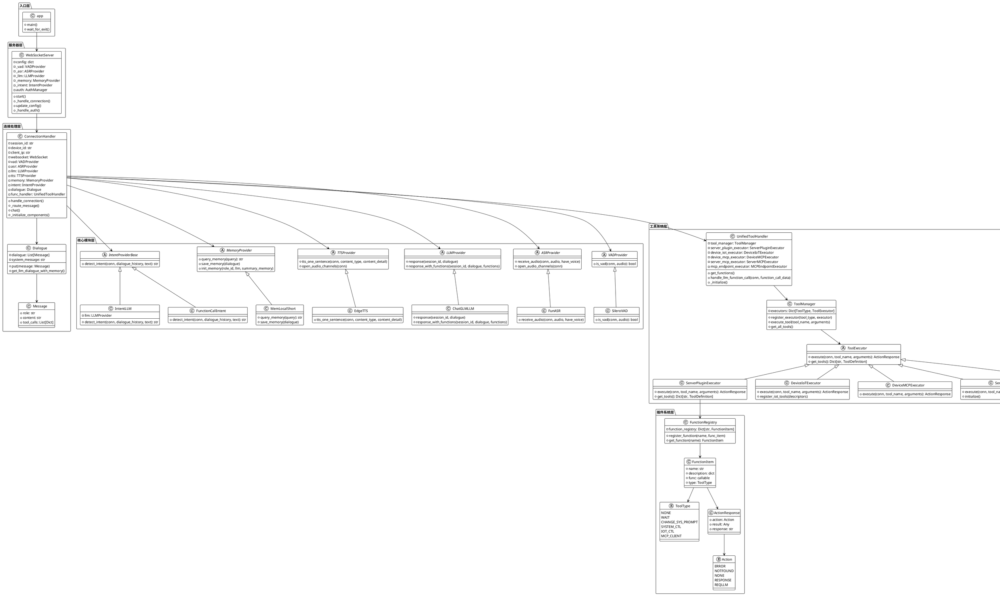

## 二、序列图

### 2.1 完整对话流程序列图

> **独立文件**：`docs/uml/02_complete_dialogue_sequence.puml`

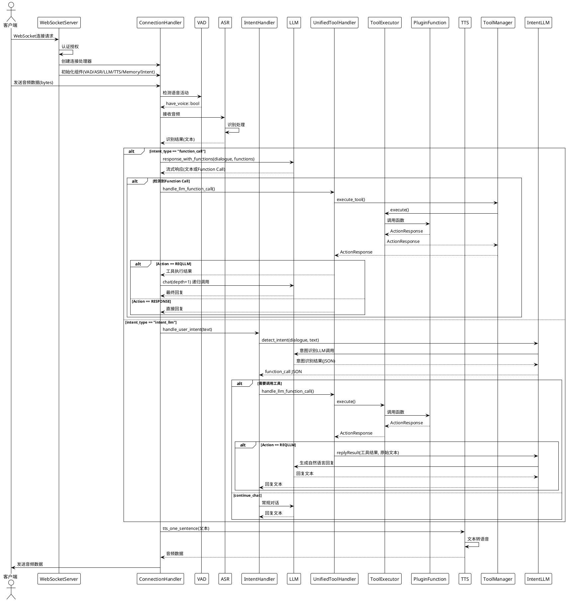

### 2.2 意图识别流程对比序列图

> **独立文件**：`docs/uml/03_intent_comparison.puml`

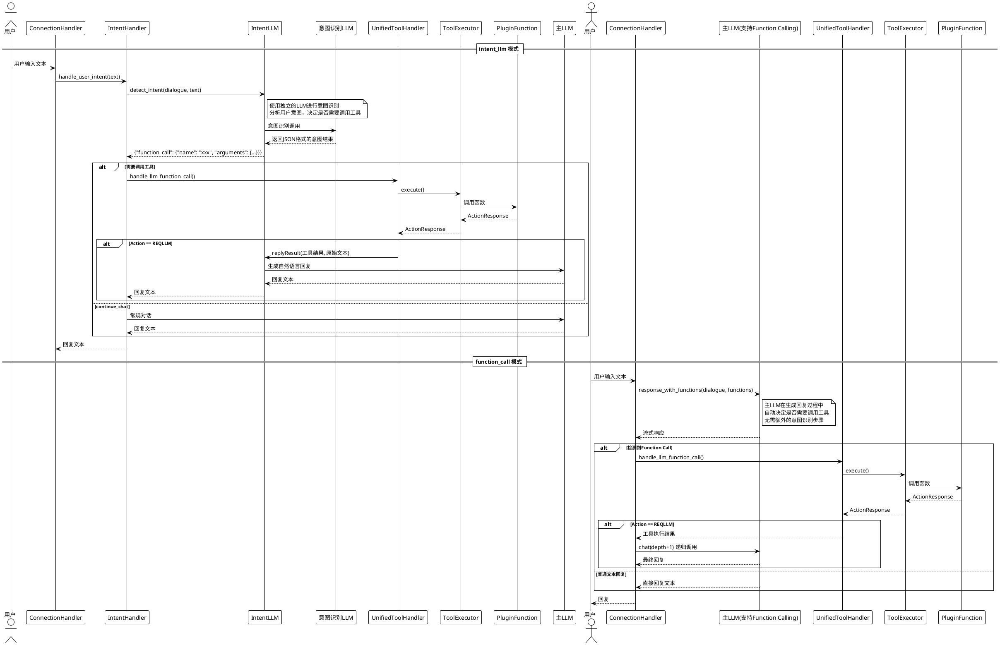

### 2.3 工具调用流程序列图

> **独立文件**：`docs/uml/04_tool_call_sequence.puml`

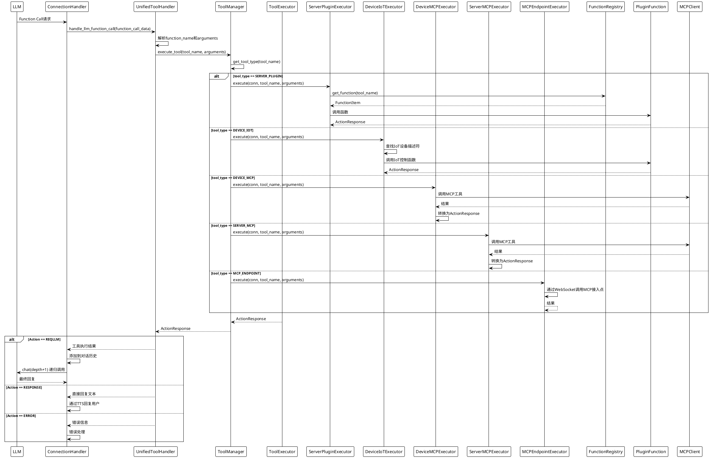

### 2.4 自定义插件加载流程序列图

> **独立文件**：`docs/uml/05_custom_plugin_loading.puml`

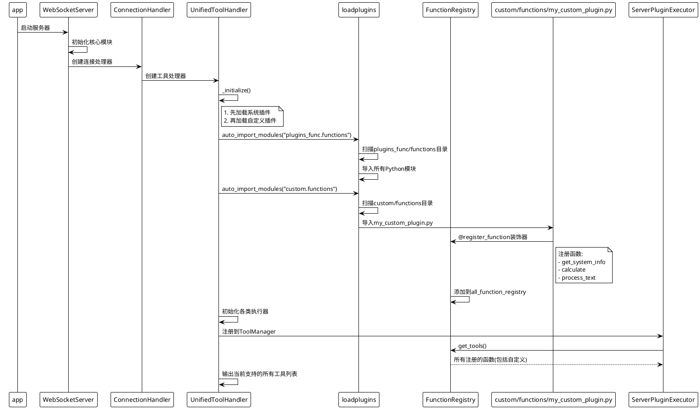

## 三、活动图

### 3.1 意图识别决策流程活动图

> **独立文件**：`docs/uml/06_intent_decision_activity.puml`

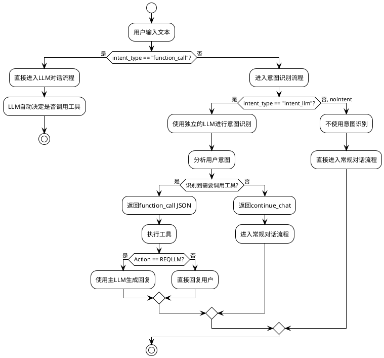

### 3.2 工具调用决策流程活动图

> **独立文件**：`docs/uml/07_tool_call_decision.puml`

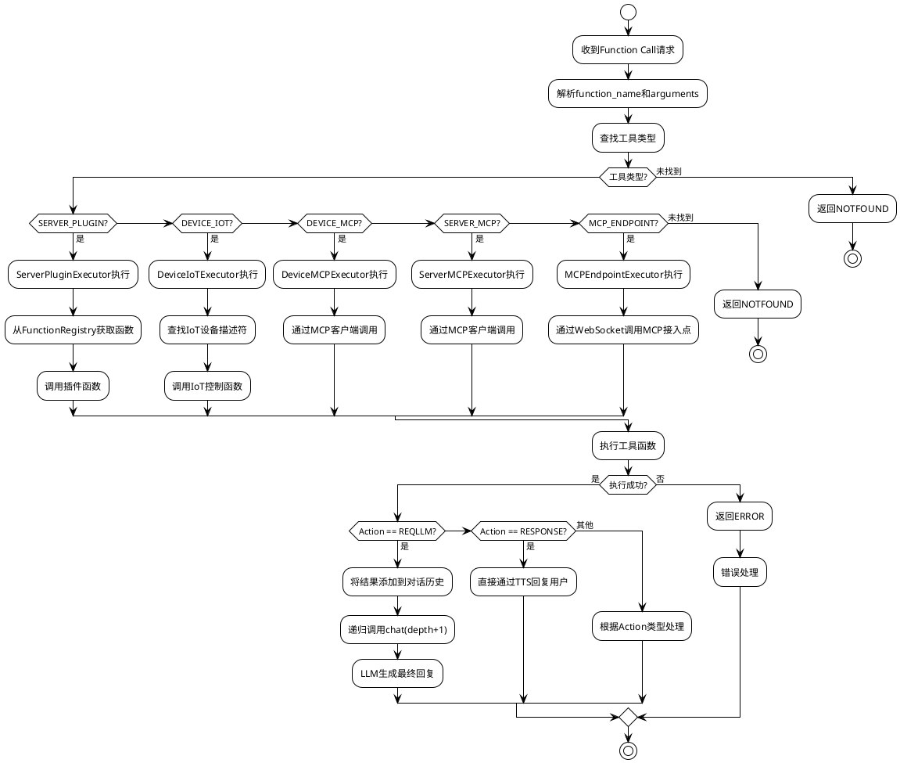

### 3.3 音频处理流程活动图

> **独立文件**：`docs/uml/08_audio_processing.puml`

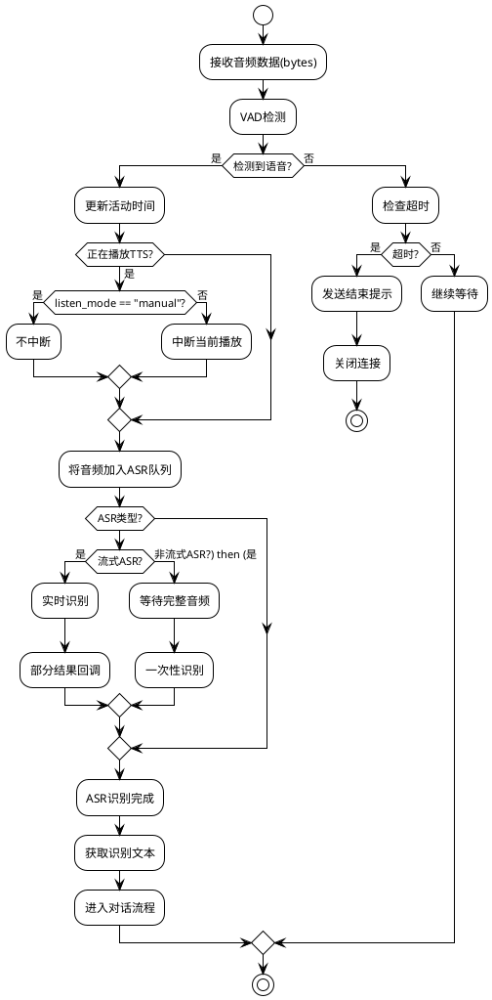

## 四、组件图

### 4.1 系统组件关系图

> **独立文件**：`docs/uml/09_component_diagram.puml`

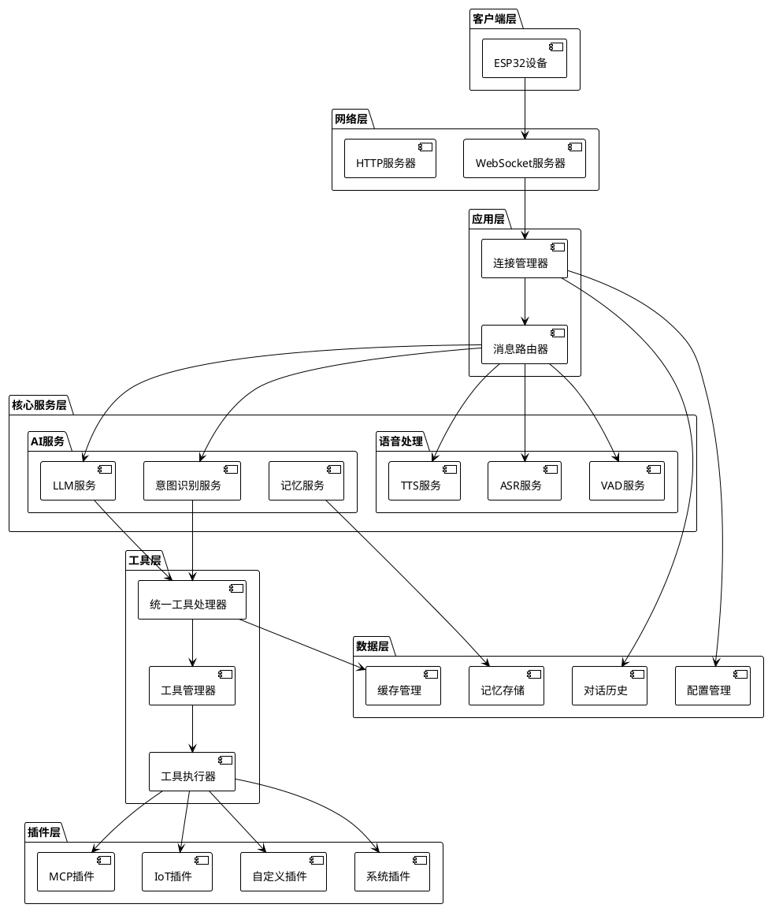

## 五、状态图

### 5.1 连接状态转换图

> **独立文件**：`docs/uml/10_connection_state.puml`

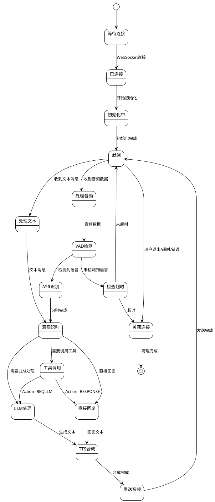

## 六、intent_llm 与 function_call 详细对比

### 6.1 核心区别

| 特性 | intent_llm | function_call |
|------|-----------|---------------|
| **工作原理** | 使用独立的LLM先进行意图识别，再决定是否调用工具 | 主LLM在对话过程中自动决定是否调用工具 |
| **处理流程** | 意图识别 → 工具调用 → LLM生成回复 | LLM对话 → 工具调用 → LLM继续对话 |
| **LLM调用次数** | 2次（意图识别LLM + 主LLM） | 1次或多次（主LLM递归调用） |
| **响应速度** | 较慢（需要额外的意图识别步骤） | 较快（无需额外步骤） |
| **成本** | 较高（需要额外的LLM调用） | 较低（只需主LLM调用） |
| **通用性** | 高（可以处理复杂的意图识别逻辑） | 中（依赖LLM的function calling能力） |
| **灵活性** | 高（可以自定义意图识别逻辑） | 中（依赖LLM的function calling实现） |
| **适用场景** | 需要复杂意图识别、需要独立控制意图识别逻辑 | LLM支持function calling、追求响应速度 |

### 6.2 使用场景建议

#### 使用 intent_llm 的场景：

1. **需要复杂的意图识别逻辑**
   - 需要根据对话历史、上下文进行复杂判断
   - 需要自定义意图识别的提示词和规则

2. **需要独立的意图识别模型**
   - 主LLM不支持function calling
   - 希望使用更轻量级的模型进行意图识别以节省成本

3. **需要精确控制工具调用时机**
   - 需要根据特定规则决定是否调用工具
   - 需要处理特殊的意图识别逻辑（如result_for_context）

4. **需要支持多函数并行调用**
   - intent_llm可以返回多个function_call的数组
   - 适合"打开灯并且调高音量"这样的复合指令

#### 使用 function_call 的场景：

1. **LLM支持function calling**
   - 使用的LLM（如ChatGLM、Doubao等）支持function calling功能
   - 希望利用LLM的原生function calling能力

2. **追求响应速度**
   - 希望减少延迟，提高响应速度
   - 不需要额外的意图识别步骤

3. **简化架构**
   - 希望简化系统架构，减少组件
   - 不需要独立的意图识别逻辑

4. **成本敏感**
   - 希望减少LLM调用次数以降低成本
   - 充分利用主LLM的能力

### 6.3 配置示例

#### intent_llm 配置：

```yaml
selected_module:
  Intent: intent_llm

Intent:
  intent_llm:
    type: intent_llm
    llm: ChatGLMLLM  # 独立的意图识别LLM
    functions:
      - get_weather
      - play_music
      - get_system_info
```

#### function_call 配置：

```yaml
selected_module:
  Intent: function_call

Intent:
  function_call:
    type: function_call
    functions:
      - get_weather
      - play_music
      - get_system_info
      - calculate
      - process_text
```

### 6.4 性能对比

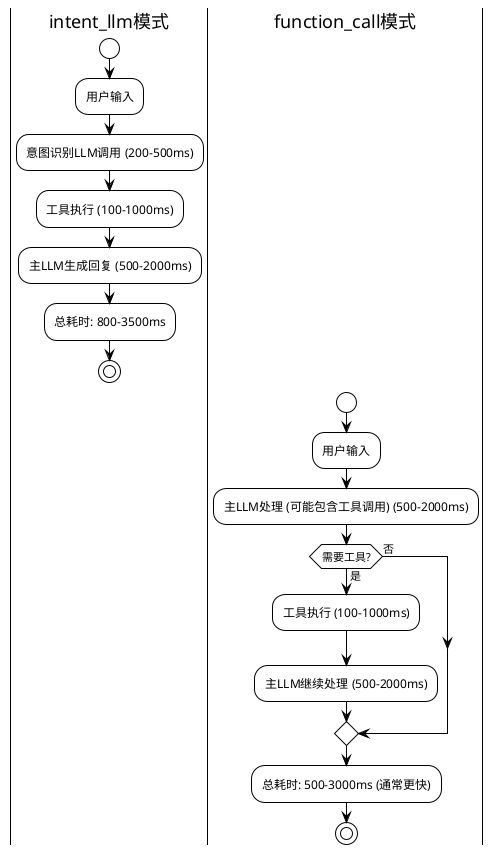

## 七、MCP调用流程序列图

> **独立文件**：`docs/uml/11_mcp_call_sequence.puml`

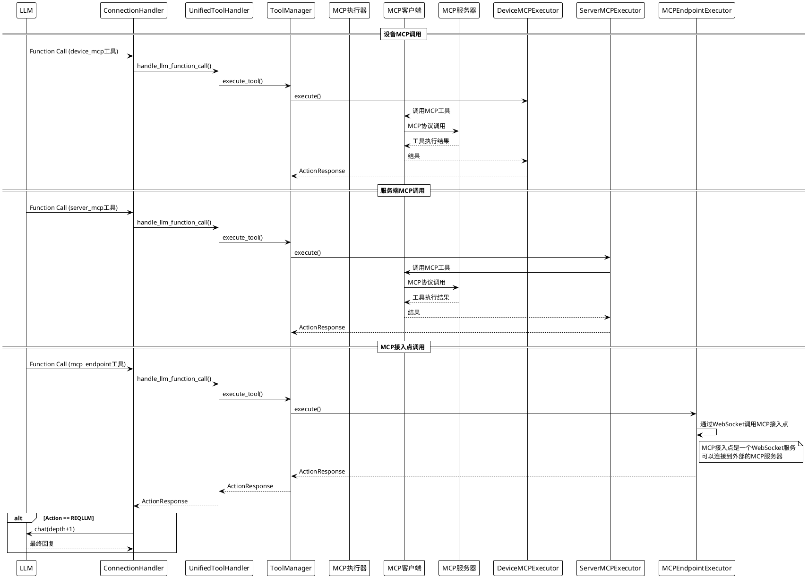

## 八、自定义插件开发流程活动图

> **独立文件**：`docs/uml/12_custom_plugin_dev.puml`

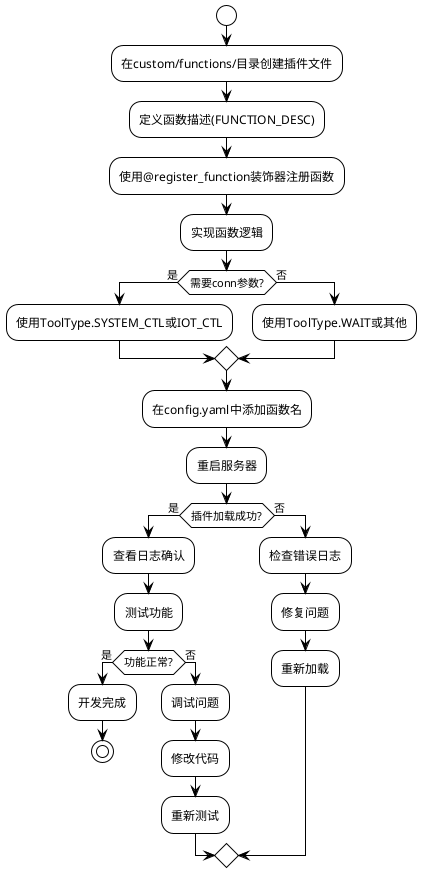

## 九、快速访问独立 UML 文件

所有 UML 图已拆分为独立文件，位于 `docs/uml/` 目录：

| 文件 | 说明 | 类型 |
|------|------|------|
| `01_core_class_diagram.puml` | 核心类图 | 类图 |
| `02_complete_dialogue_sequence.puml` | 完整对话流程 | 序列图 |
| `03_intent_comparison.puml` | 意图识别对比 | 序列图 |
| `04_tool_call_sequence.puml` | 工具调用流程 | 序列图 |
| `05_custom_plugin_loading.puml` | 自定义插件加载 | 序列图 |
| `06_intent_decision_activity.puml` | 意图识别决策 | 活动图 |
| `07_tool_call_decision.puml` | 工具调用决策 | 活动图 |
| `08_audio_processing.puml` | 音频处理流程 | 活动图 |
| `09_component_diagram.puml` | 系统组件关系 | 组件图 |
| `10_connection_state.puml` | 连接状态转换 | 状态图 |
| `11_mcp_call_sequence.puml` | MCP调用流程 | 序列图 |
| `12_custom_plugin_dev.puml` | 自定义插件开发 | 活动图 |

**查看方法**：
1. 在线查看：访问 [PlantUML 在线服务器](http://www.plantuml.com/plantuml/uml/)，复制文件内容查看
2. VS Code：安装 PlantUML 插件，打开 `.puml` 文件按 `Alt+D` 预览
3. 本地工具：`brew install plantuml` 或使用 Java jar 包

详细说明请查看：`docs/uml/README.md`

## 总结

本文档使用UML图全面描述了小智服务器的架构和流程：

1. **类图**: 展示了系统的核心类和它们之间的关系
2. **序列图**: 详细描述了各种交互流程
3. **活动图**: 展示了决策和处理流程
4. **组件图**: 展示了系统组件之间的关系
5. **状态图**: 展示了连接状态转换

### intent_llm vs function_call 总结

- **intent_llm**: 适合需要复杂意图识别、需要独立控制、可以接受稍慢响应的场景
- **function_call**: 适合LLM支持function calling、追求速度、希望简化架构的场景

选择建议：
- 如果您的LLM支持function calling（如ChatGLM、Doubao），推荐使用`function_call`
- 如果需要复杂的意图识别逻辑或使用不支持function calling的LLM，使用`intent_llm`
- 如果对响应速度要求高，优先考虑`function_call`
- 如果需要精确控制工具调用时机，使用`intent_llm`

